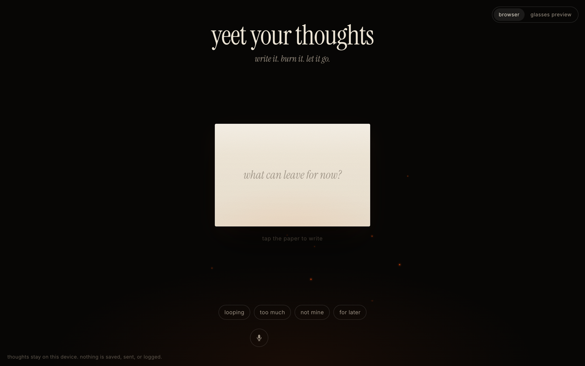
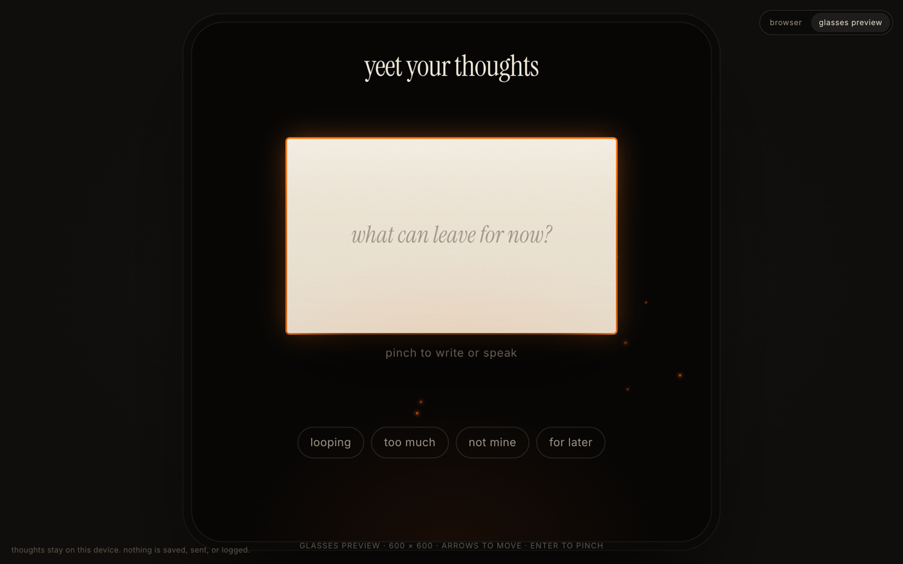
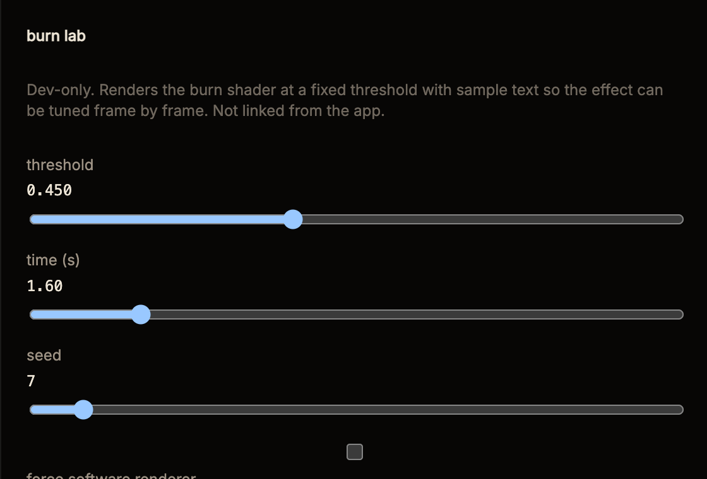
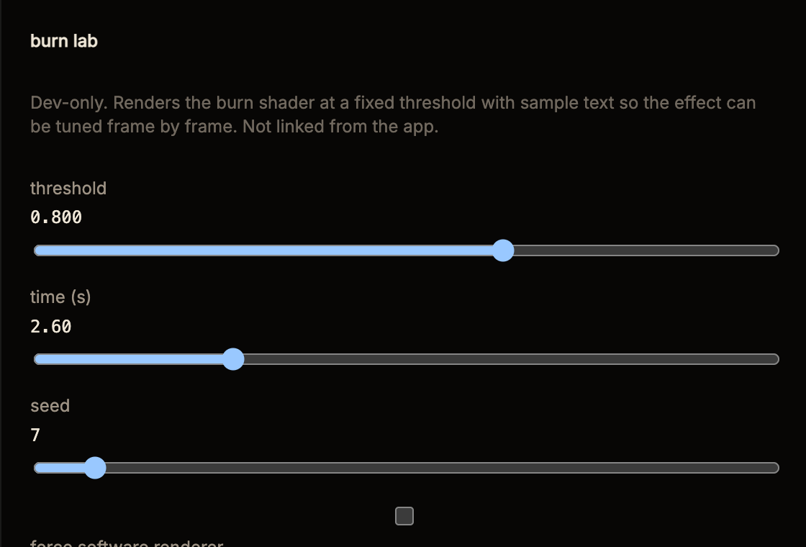

# Yeet Your Thoughts

A tiny glasses ritual for writing down a thought, burning it, and moving on.

> write it. burn it. let it go.

You type or dictate a thought you want to put down. It appears on a small
translucent sheet of paper. You select **Burn This**. The paper catches along
its bottom edge, chars, and burns away over about four seconds until only a few
embers remain. A short line appears — *gone. carry on.* — and a fresh sheet
comes back.

It is not a journal and not therapy. It is a private, twenty-second reset with a
little internet-brain humour, designed for a small monocular display and
prototyped in the browser.

## Screenshots

| browser | glasses preview (600 × 600) |
|---------|-----------------------------|
|  |  |

| the front reaches the words | almost gone |
|-----------------------------|-------------|
|  |  |

_GIF placeholder: record the full 4 s burn + afterglow and add it as
`assets/screenshots/burn.gif`._

## Quick start

There is no build step. You need a static file server because the app uses ES
modules (which browsers refuse to load from `file://`).

```bash
git clone <this repo> yeet-your-thoughts
cd yeet-your-thoughts
npm start          # → http://127.0.0.1:5173  (python3, no dependencies)
```

Alternatives:

```bash
python3 dev/serve.py 5173      # same as npm start
npx serve -l 5173 .            # if you prefer node
```

Then open <http://127.0.0.1:5173>. Add `?mode=glasses` for the glasses preview,
or open <http://127.0.0.1:5173/glasses.html> for the actual device build at
600 × 600 (use a 600 × 600 DevTools viewport and the arrow keys + Enter).

## Local development

- Edit files under `src/` and `styles/`; reload. `dev/serve.py` sends
  `Cache-Control: no-store`, so module edits show up on every reload.
- **Burn lab** — `http://127.0.0.1:5173/dev/burn-lab.html` renders the burn at
  any fixed threshold/time/seed with sample text, with a toggle for the software
  renderer. Query params `?t=0.55&time=1.8&seed=7&sw=1` make it scriptable
  for screenshots.
- Keyboard: `←/→` (or `↑/↓`) move focus between targets, `Enter`/`Space`
  select ("pinch"), `Enter` in the field commits, `Esc` leaves the field.
  `⌘/Ctrl + Shift + G` toggles the glasses preview.
- Optional web fonts (Instrument Serif, Inter) load from Google Fonts. Remove
  the two `<link>` tags in `index.html` for a fully offline build; the CSS
  falls back to system serif/sans.

## How it works

See [docs/architecture.md](docs/architecture.md) for the module map, the intent
vocabulary and the burn pipeline. In short:

- `AppState` is an explicit state machine: `idle → editing → ready → burning →
  afterglow → reset → idle`.
- `ThoughtState` is the only place the text lives, in volatile memory.
- Device input goes through an `InteractionAdapter` that emits four intents
  (`select`, `navigate`, `commit`, `back`). The browser adapter maps mouse,
  touch and keyboard; a Meta adapter slot is reserved for glasses gestures.
- The burn is a WebGL fragment shader over a bitmap of the paper, with a
  Canvas2D software fallback and a CSS-only reduced-motion variant. Sparks,
  embers and ash are a small particle system on a second canvas.

## Privacy

Privacy is part of the concept, not a policy page.

- The thought is held in application memory only. It is never written to
  storage, cookies, a database or a server. There is no backend.
- Nothing is logged. There are no `console.*` calls, no analytics, no beacons,
  no network requests from the app code (the only external requests are the
  optional web fonts).
- The text is cleared from state the moment the burn starts and exists only
  inside the paper texture until the sheet is gone; then the texture is deleted.
  Leaving or hiding the page clears everything.
- **Dictation caveat:** the browser mic button uses the Web Speech API. Most
  browsers implement it with a cloud speech service (Chrome → Google, Safari →
  Apple), so *audio* leaves the device while the mic is on, even though the
  recognised text never leaves the page. The button is opt-in and is hidden in
  glasses mode, where the device's native dictation is the intended input.

## Supported browsers

| browser | typing | dictation | WebGL burn |
|---------|--------|-----------|------------|
| Chrome / Edge 110+ | ✓ | ✓ | ✓ |
| Safari 16.4+ (macOS, iOS) | ✓ | ✓ (webkitSpeechRecognition) | ✓ |
| Firefox 115+ | ✓ | – (no Web Speech API; mic hidden) | ✓ |
| No WebGL | ✓ | depends | software renderer (lower resolution) |
| `prefers-reduced-motion` | ✓ | ✓ | CSS crossfade, no particles |

Requires ES modules, private class fields and `matchMedia`; anything from 2022
onwards is fine.

## Glasses development

The interface is designed for a small monocular display first: one sheet, one
action, four short chips, no scrolling, focus ring as the primary affordance.
The **glasses preview** (`index.html?mode=glasses`) renders the app at
600 × 600 px inside a frame so it can be recorded and demoed without hardware.

**Meta Ray-Ban Display build.** Meta's Developer Preview of "Web Apps" runs
plain HTML/CSS/JS from a public HTTPS URL directly on the glasses in a fixed
600 × 600 viewport, with Neural Band gestures delivered as `ArrowUp/Down/Left/
Right`, `Enter` and `Escape` key events. [`glasses.html`](glasses.html) is that
build:

- required meta tags (`mrbd-web-app-capable`, description, 600 × 600 viewport),
  pure-black background (transparent on the additive display), PNG icon,
  `focusable` targets with visible focus, no mic, no mode toggle;
- `src/main-glasses.js` starts the same app with `platform: 'meta-webapp'`,
  which selects `MetaInteractionAdapter` (arrows → navigate, pinch/Enter →
  select, Escape → back, composer `change` → commit);
- the `<textarea>` is itself the focusable paper target, because Meta's
  starter kit documents the on-glasses handwriting/voice composer as
  "focus the field, then pinch" — programmatic focus will not open it.

To try it on hardware: host the repo over HTTPS, enable Developer Mode in the
Meta AI app (Settings → App Info → tap the version five times), then App
Settings → App Connections → Web Apps → Add a Web App → your
`…/glasses.html` URL. Meta's Chrome extension "Meta Ray-Ban Display Simulator"
previews the additive display with a D-pad and a QA checklist.

Everything Meta documents, what runs unchanged, how text and gestures are
exposed, deployment steps, and what cannot be built yet are written up with
sources in [docs/meta-glasses.md](docs/meta-glasses.md).

## Known limitations

- Dictation depends on the browser's speech service and needs a secure context
  (`https://` or `localhost`).
- The paper bitmap is re-rendered with canvas text, so line breaks can differ
  by a pixel or two from the editable field at the moment the burn starts.
- On very low-end GPUs the fragment shader (five noise octaves × two fields)
  may drop frames; the particle budget already halves in glasses mode.
- The glasses preview approximates size and pixel grid only. It does not
  emulate the display's brightness, colour range, field of view or optics.
- The glasses build is untested on hardware. Text entry depends on Meta's
  on-glasses composer, which the docs site lists as unsupported while Meta's
  starter kit documents it; the preset chips are the fallback. See
  docs/meta-glasses.md for the open verification list.
- Web Apps on the glasses are a Developer Preview: share-link testers only,
  no public publishing yet.

## Roadmap

- [ ] Screenshots / GIF in this README
- [ ] Verify `glasses.html` on a Meta Ray-Ban Display (composer, WebGL
      performance, focus sizes); run Meta's simulator QA checklist
- [ ] Publish a privacy statement alongside the hosted URL (Meta developer terms)
- [ ] Sound: optional, very quiet paper crackle (off by default)
- [ ] A "hold to burn" variant for pointer devices
- [ ] Localised afterglow lines
- [ ] Automated visual regression of the burn via the burn lab

## License

License placeholder — see [LICENSE](LICENSE). No license has been chosen yet;
all rights reserved until one is added.
